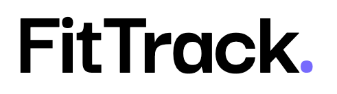

<div align="center">
  
  <h1> FitTrack </h1>
  <p><strong>A gym and running tracker built around progressive overload — not step counting.</strong></p>

  [](https://angular.dev)
  [](https://www.typescriptlang.org)
  [](https://expressjs.com)
  [](https://www.mongodb.com)
  [](https://firebase.google.com)
  [](https://web.dev/progressive-web-apps/)
  [](https://fittrack-angular-7ca07.web.app)
  <a href="https://fittrack-angular-7ca07.web.app"><strong>Try it live →</strong></a>
</div>

---

Most training apps are good at logging that you *did* something and useless at telling you whether it was any
good. FitTrack starts from the other end: every set you finish records the reps and the weight you actually hit,
and next time that exercise comes up the app hands you last session's numbers so you know what to beat.

**Topics:** `angular` · `signals` · `typescript` · `express` · `mongodb` · `mongoose` · `firebase-auth` ·
`pwa` · `leaflet` · `gps-tracking` · `capacitor` · `fitness-tracker` · `progressive-overload`

## What's in it

**Set-by-set workout logging.** Start a routine and you get a fullscreen session view: current set, target reps,
and two steppers for the reps you actually did and the weight you used. Sets are stored individually (`setReps`,
`setWeights`), so History shows `10 / 9 / 8 reps` against `62.5 / 65 / 67.5 kg` instead of one flattened average.
Finish the session and you get total volume lifted plus the delta against the last time you ran that routine.

**Legends'Plans.** Real training splits from Arnold Schwarzenegger, Mike Mentzer, Chris Bumstead, Ronnie Coleman
and Dorian Yates, with full exercise lists and one tap to start any day. Adding another athlete is a data entry in
`start-workout.component.ts` and nothing else.

**Running with GPS.** A Leaflet map that stays hidden until you hit start, then goes fullscreen. The tracker
filters GPS noise — accuracy thresholds, implausible speed jumps, a short calibration window — so one bad fix
doesn't add 200 m to your distance. Routes are saved and redrawn in History as SVG with start/finish markers,
pace per kilometre and expandable details.

**Community feed.** Publish a routine, like it, comment, save someone else's into your own library. Ranked by a
trending score (interactions with exponential time decay), filterable by muscle group and duration, with
For You / Following / Recent tabs, search, infinite scroll and a "FitTrack Picks" row of the month's most-saved
routines.

**Profile.** Avatar upload (resized client-side to 256 px, stored as a data URL so there's no object storage to
provision), follower and following lists, your posts with their like and save counts.

**Nutrition.** BMI, BMR and a daily calorie target derived from the profile you set at onboarding, plus a
chat-style assistant for macro questions. Workout calories are MET estimates from
`core/utils/workout-calories.ts`, weighted by your body weight.

**Works offline.** Service worker app-shell caching, installable on iOS and Android, and a local cache layer that
lets you log a workout with no signal and resyncs it when you reconnect.

## Stack

| Layer | Choice | Note |
| --- | --- | --- |
| Frontend | Angular 21 | Standalone components, signals for state — no NgRx, the app doesn't need it |
| UI | ng-zorro-antd 21 | Used as a base, then restyled into an Apple-ish "liquid glass" system in `src/styles.css` |
| Auth | Firebase Authentication | Email + Google; ID tokens verified server-side with the Admin SDK |
| API | Express 4 | zod for request validation, helmet, express-rate-limit |
| Database | MongoDB + Mongoose 8 | Local in dev, Atlas in production |
| Maps | Leaflet + Capacitor Geolocation | |
| Hosting | Firebase Hosting + Render | Static frontend, API on Render |

## Running it locally

You need Node 20+, a running MongoDB, and a Firebase project (free tier is fine).

```bash
git clone https://github.com/CristianCiulica/FitTrack-Angular.git
cd FitTrack-Angular
npm install
npm install --prefix server
```

Copy the frontend config template and fill in your Firebase Web App values:

```bash
cp .env.example .env.local
```

Do the same for the API, then drop in a service account key from
*Firebase console → Project settings → Service accounts → Generate new private key*, saved as
`server/firebase-service-account.json`:

```bash
cp server/.env.example server/.env
```

Run both halves in two terminals:

```bash
npm run server   # Express on :4000
npm start        # Angular on :4200
```

One thing worth knowing up front: if your Firebase Web API key has HTTP referrer restrictions, **port 4200 has to
be on the allowlist** or Google sign-in dies with `auth/requests-from-referer-...-are-blocked`. `ng serve` grabbing
a different port is the usual cause.

## Layout

```
src/app/
  core/
    services/     # api, auth, profile, workout, running-session, community, weather, migration
    guards/       # auth, guest, onboarding
    interceptors/ # attaches the Firebase ID token once the session is restored
    utils/        # unit conversion, MET calorie estimates
  features/       # dashboard, workouts, start-workout, running, bmi, community,
                  # profile, account, settings, onboarding, auth
  shared/         # workout modal, mobile menu drawer

server/src/
  routes/         # me, workouts, running-sessions, community, migrate
  models/         # mongoose schemas
  middleware/     # requireAuth, error handler, rate limits
```

Longer write-ups live in [`docs/`](docs/): [architecture](docs/architecture-guide.md),
[features](docs/feature-guide.md), [setup](docs/setup-guide.md),
[troubleshooting](docs/troubleshooting-guide.md).

## API

Everything under `/api` needs a valid Firebase ID token (`Authorization: Bearer <token>`).

| Method | Endpoint | Purpose |
| --- | --- | --- |
| `GET` `PATCH` `DELETE` | `/api/me` | Profile read / update / full account deletion |
| `GET` | `/api/me/export` | Download all your data as JSON |
| `GET` `POST` `PUT` `DELETE` | `/api/workouts` | Workout CRUD, including per-set reps and weights |
| `GET` `POST` `DELETE` | `/api/running-sessions` | Runs with their GPS routes |
| `GET` | `/api/community` | Feed with paging, filters and trending / recent sorting |
| `GET` | `/api/community/picks` | Most-saved routines of the last 30 days |
| `GET` | `/api/community/author/:uid` | Public author profile and posts |
| `POST` | `/api/community/:id/like` · `/save` · `/comments` | Social actions |
| `POST` | `/api/community/follow/:uid` | Follow / unfollow toggle |
| `GET` | `/api/community/me/followers` · `me/following` | Your social graph |

## Deploying

The frontend picks its API base URL at runtime from the hostname — `localhost` talks to `:4000`, anything else
talks to the Render deployment — so shipping is just:

```bash
npm run build && npx firebase deploy --only hosting
```

The API redeploys from `main` on Render. Full walkthrough including Atlas setup is in [DEPLOY.md](DEPLOY.md).

Two production problems that shaped the code rather than getting papered over:

- **Render's free tier sleeps** after ~15 minutes idle and needs 20–50 s to wake, which broke the first request of
  the day. `ApiService` now retries GETs with backoff (2s → 5s → 12s → 20s), and a GitHub Actions cron pings
  `/api/health` every 10 minutes to keep the instance warm.
- **Firebase ID tokens outlive deleted accounts.** `GET /api/me` verifies the user still exists in Firebase Auth
  before upserting a profile — without that check, a request still in flight during account deletion silently
  recreated the profile that had just been removed.

## Install on a phone

The production build is a PWA with a home-screen icon and offline app-shell caching. On iOS open the site in
Safari → **Share** → **Add to Home Screen**. On Android open it in Chrome → menu → **Install app**. The service
worker is only active in production builds.

Regenerate the icon set after changing the source logo:

```bash
npm run icons:pwa
```

## Android wrapper

Capacitor is wired up (`capacitor.config.ts`, `android/`) if you want a native shell:

```bash
npm run build && npx cap sync android && npx cap open android
```

## Tests

```bash
ng test    # Vitest
```

## License

No licence file yet — add one if you plan to reuse this. The bodybuilder photos in `public/legends/` are
illustrative and not mine to relicense.
